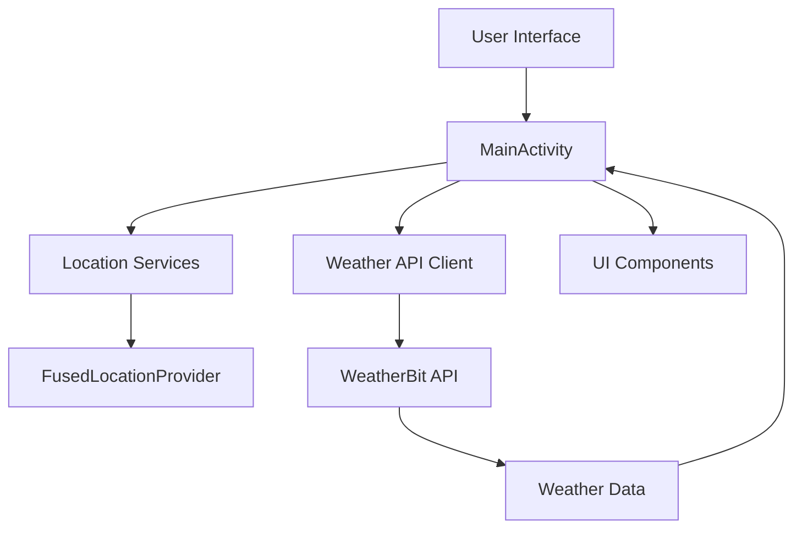
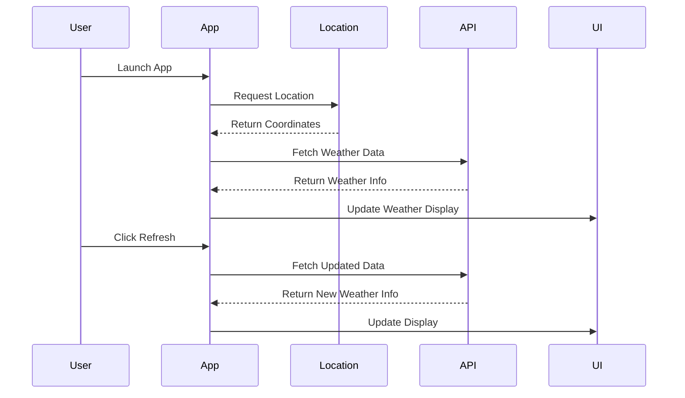
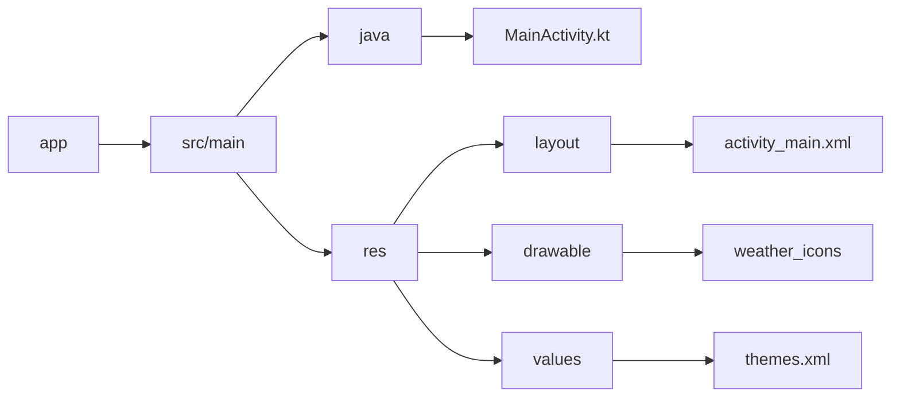

# Weather App 🌤️

An Android weather application that provides real-time weather information based on the user's location. Built with Kotlin and following Material Design principles, this app offers a seamless weather monitoring experience.

## Features 🌟

- **Real-time Weather Data**: Get instant weather updates for your current location
- **Detailed Weather Information**:
  - Current temperature with "feels like" temperature
  - Precipitation data
  - Snow accumulation
  - Weather conditions
  - City name
- **Dynamic Weather Icons**: Beautiful vector-based weather icons that change based on conditions
- **Day/Night Mode**: Automatic theme switching based on time of day
- **Location-based**: Uses device GPS for accurate local weather
- **Refresh Capability**: Manual refresh button for updated weather data

## Technical Architecture 🏗️

## Data Flow 📊

## Technology Stack 🛠️

- **Language**: Kotlin
- **Minimum SDK**: 24 (Android 7.0)
- **Target SDK**: 33 (Android 13)
- **Libraries**:
  - Volley: For network requests
  - Google Play Services Location: For location services
  - Material Design Components: For UI elements
- **API**: WeatherBit API for weather data

## Project Structure 📁

## Setup and Installation 🚀

1. Clone the repository
2. Open the project in Android Studio
3. Get your API key from [WeatherBit](https://www.weatherbit.io/api/weather-current)
4. Add your API key in `MainActivity.kt`
5. Build and run the application

## Permissions Required 🔐

- `ACCESS_FINE_LOCATION`: For precise location data
- `ACCESS_COARSE_LOCATION`: For approximate location data
- `INTERNET`: For API communication

## Future Improvements 🎯

- [ ] Add weather forecasts for upcoming days
- [ ] Implement location search functionality
- [ ] Add weather alerts and notifications
- [ ] Include more detailed weather metrics
- [ ] Implement weather widgets
- [ ] Add support for multiple units (metric/imperial)
- [ ] Implement offline caching
- [ ] Add weather maps integration

## Contributing 🤝

Contributions are welcome! Please feel free to submit a Pull Request.

## Acknowledgments 🙏

- WeatherBit API for providing weather data
- Google Play Services for location functionality
- Material Design for UI components
